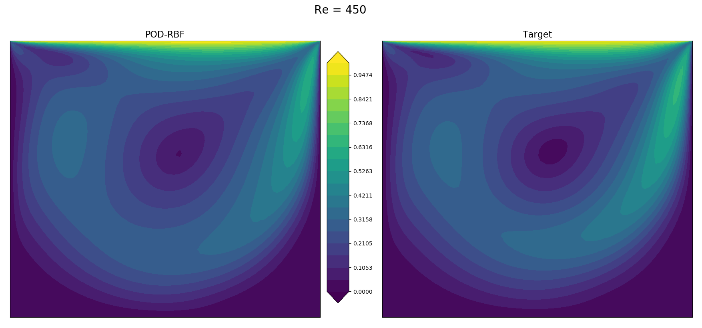
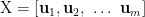
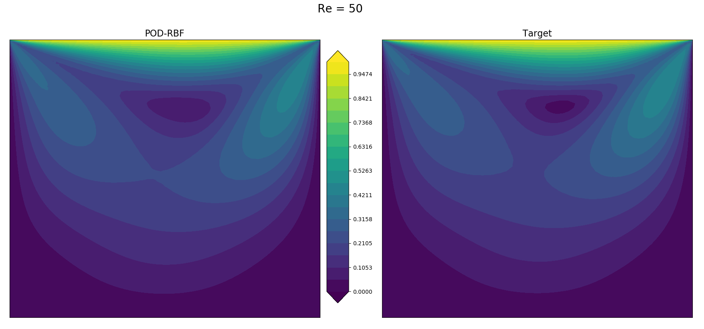

# POD-RBF



A Python package for building a Reduced Order Model (ROM) from high-dimensional data using a Proper
Orthogonal Decomposition - Radial Basis Function (POD-RBF) Network.

Given a 'snapshot' matrix of the data points with varying parameters, this code contains functions
to find the truncated POD basis and interpolate using a RBF network for new parameters.

Features:

* Shape parameter optimization for the Radial basis Functions (RBFs)
* Algorithm switching based on memory requirements (eigenvalue decomposition vs. SVD)

## Installation

Simply install using pip as

```bash
pip install pod_rbf
```

## Example

In the [example](https://github.com/kylebeggs/POD-RBF/tree/master/examples) folder you can find two
examples of that demonstrates how to use the package. The first is a simple heat conduction problem
on a unit square.

The other example will be demonstrated step-by-step here. We seek to build a ROM of the 2D
lid-driven cavity problem. For the impatient, here is the full code to run this example. I will
break down each line in the sections below.

```python
import pod_rbf

Re = np.linspace(0, 1000, num=11)
Re[0] = 1

# make snapshot matrix from csv files
train_snapshot = pod_rbf.buildSnapshotMatrix("examples/lid-driven-cavity/data/train/re-%.csv")

model = pod_rbf.pod_rbf(energy_threshold=0.99)  # create model object
model.train(train_snapshot, Re)  # train the model
sol = model.inference(450)  # inference the model on an unseen parameter
```

### Building the snapshot matrix

First, we need to build the snapshot matrix, X, which contains the data we are training on. It must
be of the form where each column is the k-th 'snapshot' of the solution field given some
parameter, p_k, with n samples in the snapshot.


The snapshot matrix would then look like



where $m$ is the number of snapshots.

For example, suppose our lid-driven cavity was solved on a mesh with 400 cells and we varied the
parameter of interest (Re number in this case) 10 times. We would have a matrix of size (n,m) =
(400,10).

For our example, solutions were generated using STAR-CCM+ for Reynolds numbers of 1-1000 in
increments of 100. The Re number will serve as our single parameter in this case. Snapshots were
generated as a separate .csv file for each. To make it easier to combine them all into the snapshot
matrix, there is a function which takes the path and file pattern. The same syntax is borrowed from
the ffmpeg tool - that is, if you had files named as sample_001.csv, sample_002.csv ... you would
input sample_%03d.csv. The files for this example are named as re-%04d.csv so we would issue a
command as

```python
>>> import pod_rbf
>>> train_snapshot = pod_rbf.buildSnapshotMatrix("examples/lid-driven-cavity/data/train/re-%.csv")
```

---
Note: if you are using this approach where each snapshot is contained in a different csv file,
please group all of them into a directory of their own.

---

If you notice, these files are contained in the train folder, as I also generated some more
snapshots for validation (which as you probably guessed is in the /data/validation folder). now we
need to generate the array of input parameters that correspond to each snapshot.

```python
>>> Re = np.linspace(0, 1000, num=11)
>>> Re[0] = 1
```

---
Note: it is extremely important that each input parameter maps to the same element number of the
snapshot matrix. For example if the 5th column (index 4) then the input parameter used to generate
that snapshot should be what you find in the 5th element (index 4) of the array, e.g.
```train_snapshot[:,4] -> Re[4]```. The csv files are loaded in alpha-numeric order so that is why
the input parameter array goes from  1 -> 1000.

---

where ```Re``` is an array of input parameters that we are training the model on. Next, we create
the model object and in only one method call, we can train our network. We choose to keep 99% of the
energy in POD modes here, and that is the only input to the object creation. (99% is also the
default, so you don't have to set that)

```python
>>> model = pod_rbf.pod_rbf(energy_threshold=0.99)
>>> model.train(train_snapshot, Re)
```

Now that the weights and truncated POD basis have been calculated are stored, we can inference on
the model using any input parameter.

```python
>>> sol = model.inference(450)
```

and we can plot the results comparing the inference and target below


and for Reynold's number of 50:


